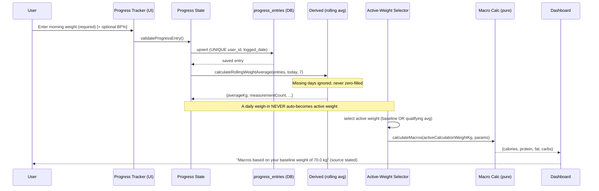
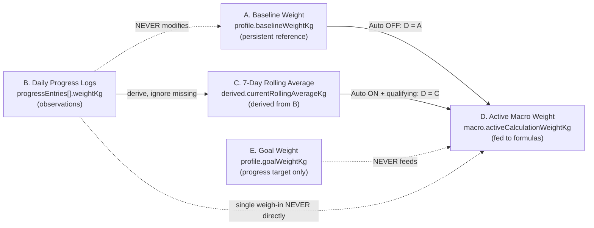
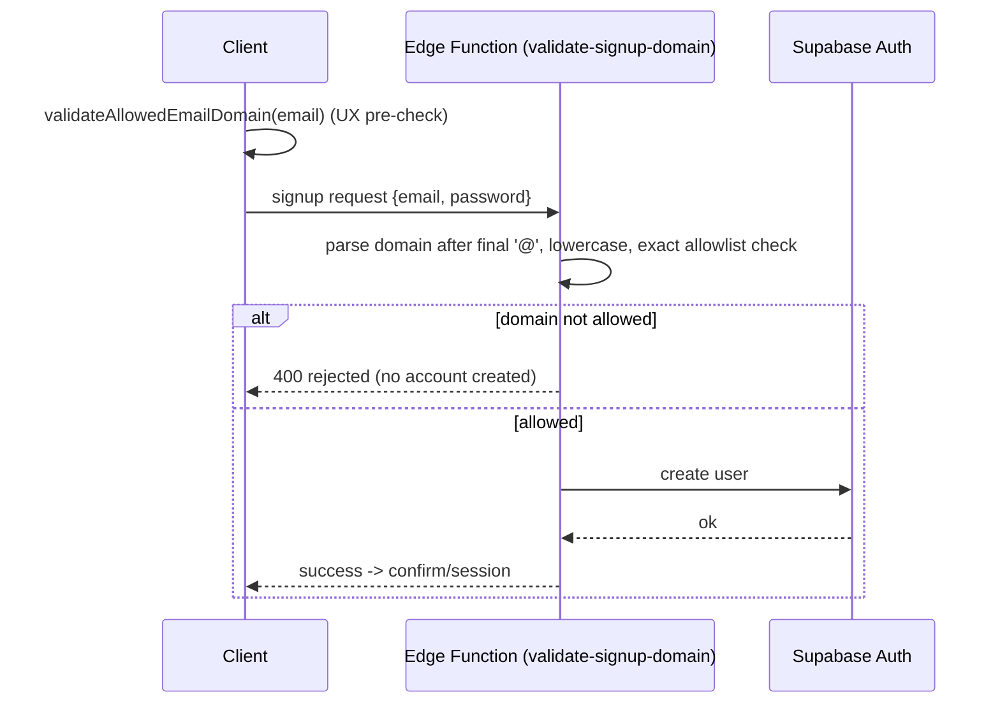

# Design Document: Macro & Body Composition Calculator (Evolve Fitness)

## Overview

The Macro & Body Composition Calculator is a polished, Android-mobile-first, installable PWA for Evolve Fitness. It calculates daily bulking/surplus macronutrient targets, BMI, U.S. Navy body-fat percentage, fat mass, and lean body mass; and it supports authenticated accounts, persistent baseline profiles, daily morning-weight logging, 7-day rolling weight averages, optional automatic weekly macro updates, goal-weight progress, body-composition trend charts, optional reminders, and secure account/data deletion.

The application is built with **React + Vite + TypeScript**, **Tailwind CSS**, **Framer Motion**, **Supabase JS (Auth + PostgreSQL)**, **Lucide icons**, and **Recharts**, with **Vitest + React Testing Library** for testing. It intentionally does **not** include food logging, meal tracking, barcode scanning, or workout/water/sleep/step tracking.

The single most important architectural theme is the strict separation of **five distinct weight concepts** (baseline, daily progress logs, 7-day rolling average, active macro-calculation weight, and goal weight). Every layer — UI, state, calculation, database, and tests — treats these as independent concerns. Calculation logic is implemented as pure, side-effect-free functions that receive an explicitly-selected active weight; the selection of *which* weight feeds the macro formulas happens outside the calculation layer and is never an implicit side effect of logging a weigh-in.

This document provides both a **High-Level Design** (architecture, component hierarchy, data model, database schema, security boundaries, design system) and a **Low-Level Design** (pure-function signatures, formal specifications, algorithmic pseudocode, and executable correctness properties).

---

# PART I — HIGH-LEVEL DESIGN

## Architecture

The system is a client-heavy SPA/PWA that talks to Supabase for authentication and data persistence. Trust-sensitive operations (email-domain allowlist enforcement, account + data deletion) are performed at a server boundary (Supabase Edge Functions and/or database triggers), never solely on the client. The service-role key is never shipped to the browser.

```mermaid
graph TD
    subgraph Client["Client (React + Vite PWA)"]
        UI[UI Layer: Screens & Components]
        SM[State Layer: Auth / Profile / Progress / Macro Contexts + React Query]
        CALC[Pure Calculation Layer: macro, bmi, bodyfat, averages, goal]
        VAL[Validation Layer: email, macro settings, navy, progress, goal]
        SDK[Supabase Client - anon key only]
        SW[Service Worker / PWA cache]
        UI --> SM
        SM --> CALC
        SM --> VAL
        SM --> SDK
    end

    subgraph Supabase["Supabase (Server Boundary)"]
        AUTH[Auth: email + password, sessions]
        DB[(PostgreSQL + RLS)]
        EF1[Edge Function: validate-signup-domain]
        EF2[Edge Function: delete-account-and-data]
        TRG[DB Triggers / CHECK constraints]
    end

    SDK -->|sign up / in / out| AUTH
    SDK -->|CRUD own rows via auth.uid| DB
    SDK -->|invoke| EF1
    SDK -->|invoke| EF2
    AUTH --> EF1
    EF2 -->|service-role, server-only| AUTH
    EF2 -->|cascade delete| DB
    DB --> TRG
    DB -. RLS: auth.uid = user_id .-> DB
```

### Architectural layers

| Layer | Responsibility | Key rule |
|-------|----------------|----------|
| **UI (Screens/Components)** | Rendering, input capture, animation, accessibility | No business math inline; delegates to calculation layer |
| **State** | Auth session, profile, progress entries, macro settings, derived values; source-of-truth selection for active weight | Chooses which weight is "active" *before* calling calc functions |
| **Calculation (pure)** | Deterministic math: macros, BMI, Navy BF%, fat/lean mass, rolling average, goal progress | No I/O, no rounding of intermediates, receives active weight as argument |
| **Validation** | Email domain, macro settings, Navy inputs, progress entries, goal weight | Centralized, reused client + server where applicable |
| **Data access** | Supabase queries scoped by `auth.uid()` | Canonical units only (kg, cm, %) |
| **Server boundary** | Domain allowlist enforcement, account deletion | Uses service-role key server-side only |

### Data-flow: logging a weigh-in vs. computing macros



## Components and Interfaces

This section defines both the **React component hierarchy** (the UI-facing components and screens) and the **calculation/validation function interfaces** (the pure, side-effect-free contracts those components delegate to). The component tree below establishes the rendering and navigation structure; the *Calculation & Validation Function Interfaces* subsection that follows summarizes the programmatic contracts, whose full low-level signatures, preconditions, and postconditions are specified in **Part II — Low-Level Design**.

### React Component Hierarchy

```mermaid
graph TD
    App[App / Router] --> AuthGate[ProtectedRoute + AuthProvider]
    AuthGate --> Onboarding[OnboardingFlow]
    AuthGate --> Shell[AppShell: BottomNav / Sidebar + ThemeToggle]

    Shell --> Dashboard[DashboardScreen]
    Shell --> Calculator[CalculatorScreen]
    Shell --> Progress[ProgressScreen]
    Shell --> Profile[ProfileScreen]

    Dashboard --> MacroSourceBanner
    Dashboard --> CalorieRing[AnimatedCalorieRing]
    Dashboard --> MacroBars[Carb/Protein/Fat bars]
    Dashboard --> BodyCompSummary

    Calculator --> PersonalDetails
    Calculator --> BodyMeasurements
    Calculator --> AdvancedMacroSettings
    Calculator --> NutritionResults
    Calculator --> MacroVisualization
    Calculator --> BodyCompositionResults
    Calculator --> BodyFatGauge[AnimatedBodyFatGauge]
    Calculator --> Methodology

    Progress --> ProgressSummary
    Progress --> GoalProgressCard
    Progress --> AddWeightForm
    Progress --> RollingAverageCard
    Progress --> WeightTrendChart
    Progress --> BodyFatTrendChart
    Progress --> FatLeanTrendChart
    Progress --> MacroHistoryList

    Profile --> BaselineManager
    Profile --> GoalWeightManager
    Profile --> MacroSettingsForm
    Profile --> AutoMacroToggle
    Profile --> UnitsThemeSettings
    Profile --> RemindersSettings
    Profile --> AccountDeletion[DangerZone: Delete Account & Data]
```



### Screen flows

- **Calculator**: Personal Details → Body Measurements → Advanced Macro Settings → Calculate → Nutrition Results → Macro Visualization → Body Composition → Body Fat Gauge → Methodology.
- **Progress**: Summary → Goal Progress → Add Today's Weight → 7-Day Average → Daily + Average Trend → Body Fat Trend → Fat/Lean Trends → History.
- **Profile**: Baseline → Goal Weight → Macro Settings → Auto Macro Update → Units/Theme → Reminders → Account/Delete.

Bottom navigation (Dashboard, Calculator, Progress, Profile) on mobile transitions to a sidebar on larger screens.

### Calculation & Validation Function Interfaces

The UI components above never embed business math. They delegate to a set of pure calculation and validation interfaces exposed by the calculation and validation layers. These are the programmatic "components and interfaces" of the system; their full signatures, formal preconditions, and postconditions are detailed in **Part II — Low-Level Design** (see *Calculation Architecture*, *Macro Calculation*, *BMI Calculation*, *U.S. Navy Body Fat*, *Body Composition*, *7-Day Rolling Weight Average*, *Auto Macro Update Qualification*, *Goal Progress*, and *Validation Layer*).

| Interface | Signature (summary) | Consumed by |
|-----------|---------------------|-------------|
| Unit conversion | `kgToLb`, `lbToKg`, `cmToInches`, `inchesToCm` | Calculator, Progress, Profile inputs/displays |
| Macro calculation | `calculateMacros(activeCalculationWeightKg, settings): MacroResult` | Dashboard, Calculator (Nutrition Results) |
| BMI | `calculateBMI(weightKg, heightCm)`, `getBMICategory(bmi, age)` | Calculator (Body Composition Results) |
| Navy body fat | `calculateMaleNavyBodyFat(...)`, `calculateFemaleNavyBodyFat(...)` | Calculator (Body Fat Gauge) |
| Body composition | `calculateFatMass`, `calculateLeanBodyMass`, `getBodyFatCategory` | Calculator, Body-composition summaries/charts |
| Rolling average | `calculateRollingWeightAverage(entries, endDate, windowDays): RollingAverageResult` | Progress (Rolling Average Card, trend charts) |
| Auto-update qualification | `isAutoMacroUpdateQualified(entries, period, min): AutoUpdateQualification` | Profile (Auto Macro Toggle), Dashboard messaging |
| Goal progress | `calculateGoalProgress(starting, current, goal): GoalProgress` | Progress (Goal Progress Card) |
| Validation | `validateAllowedEmailDomain`, `validateMacroSettings`, `validateNavyMeasurements`, `validateProgressEntry`, `validateGoalWeight` | Onboarding, Calculator, Progress, Profile forms |

**Interface boundary rule:** the selection of *which* weight is passed as `activeCalculationWeightKg` is made in the state layer (see *State Management Strategy*), never inside the calculation interfaces themselves. Every interface listed here is pure and deterministic with respect to its explicit arguments.

## Data Models

The data layer is organized around three complementary views of the same domain: the **five-concept weight model** (the core invariant that keeps the five weight concepts distinct), the **core TypeScript types** (the in-memory shapes consumed by the calculation and state layers), and the **database schema/entities** (the persisted, RLS-protected canonical store). All three are consolidated here.

### The Five-Concept Data Model (Core Invariant)

These five concepts are modeled as **distinct fields/derivations** and are never conflated. This is the backbone of the entire design.



| # | Concept | Field | Role | Hard rules |
|---|---------|-------|------|-----------|
| A | Baseline weight | `profile.baseline_weight_kg` | Persistent reference; macro weight when Auto Update OFF | Never auto-overwritten; only changed by deliberate, confirmed edit |
| B | Daily progress logs | `progress_entries[].weight_kg` | Historical morning-weight observations | Never modifies baseline; a single entry never becomes active weight |
| C | 7-day rolling average | `derived.currentRollingAverageKg` | Derived from valid entries in last 7 calendar days | Ignores missing days (never zero-filled); reports measurement count |
| D | Active macro weight | `macro.activeCalculationWeightKg` (persisted `active_macro_weight_kg`) | The only weight fed to macro formulas | Selected outside calc layer; = A when Auto OFF, = C when Auto ON + qualifying |
| E | Goal weight | `profile.goal_weight_kg` | Progress target for display only | Never becomes macro/baseline/active weight |

**Active-weight selection rule (executed in the state layer, not the calculation function):**

```
IF NOT autoMacroUpdateEnabled          -> activeCalculationWeightKg = baselineWeightKg
ELSE IF qualifyingRollingAverageExists -> activeCalculationWeightKg = currentRollingAverageKg
ELSE                                   -> activeCalculationWeightKg = previous active weight (unchanged), show status
```

### Core TypeScript Types

The in-memory data models — `Unit`, `Sex`, `BodyFatMethod`, `MacroSettings`, `MacroResult`, `ProgressEntry`, `RollingAverageResult`, `AutoUpdateQualification`, and `GoalProgress` — are the canonical TypeScript shapes that the calculation and state layers operate on. Their complete field-by-field definitions are specified in **Part II — Low-Level Design** under *Calculation Architecture (Pure Functions) → Core types*, alongside the centralized `CONFIG` thresholds. These types map directly onto the persisted entities defined in the database schema below (e.g., `ProgressEntry.weightKg` ↔ `progress_entries.weight_kg`, `MacroSettings.*Multiplier` ↔ `macro_settings.*_multiplier`), with all persistence using canonical units (kg, cm, %).

### Database Schema & RLS

All tables have Row-Level Security **enabled**; every policy restricts access to rows where `user_id = auth.uid()`. Canonical stored units: **weight in kg, height/circumference in cm, body fat in %**. Conversions happen only for display/input.

```mermaid
erDiagram
    auth_users ||--|| profiles : "1:1"
    auth_users ||--|| macro_settings : "1:1"
    auth_users ||--o{ progress_entries : "1:many"
    auth_users ||--o{ macro_target_history : "1:many"
    auth_users ||--o| reminder_preferences : "0..1"

    profiles {
        uuid user_id PK_FK
        text name
        int age
        text biological_sex
        text preferred_unit
        numeric height_cm
        numeric baseline_weight_kg
        numeric neck_cm
        numeric waist_cm
        numeric hip_cm
        numeric goal_weight_kg
        numeric goal_start_weight_kg
        timestamptz goal_created_at
        boolean auto_macro_update_enabled
        numeric active_macro_weight_kg
        timestamptz last_auto_macro_update_at
        boolean onboarding_completed
        timestamptz created_at
        timestamptz updated_at
    }
    macro_settings {
        uuid user_id PK_FK
        numeric calorie_multiplier
        numeric protein_multiplier
        numeric fat_multiplier
        timestamptz updated_at
    }
    progress_entries {
        uuid id PK
        uuid user_id FK
        date logged_date
        numeric weight_kg
        numeric body_fat_percentage
        text body_fat_method
        timestamptz created_at
        timestamptz updated_at
    }
    macro_target_history {
        uuid id PK
        uuid user_id FK
        date effective_date
        numeric calculation_weight_kg
        text source
        numeric rolling_average_kg
        numeric calorie_multiplier
        numeric protein_multiplier
        numeric fat_multiplier
        numeric calculated_calories
        numeric calculated_protein_g
        numeric calculated_fat_g
        numeric calculated_carbs_g
        timestamptz created_at
    }
    reminder_preferences {
        uuid user_id PK_FK
        boolean enabled
        text check_in_schedule
        timestamptz updated_at
    }
```

### Constraints & keys (illustrative DDL)

```sql
-- profiles: 1:1 with auth.users, RLS enabled
create table profiles (
  user_id uuid primary key references auth.users(id) on delete cascade,
  name text not null,
  age int check (age > 0 and age < 130),
  biological_sex text check (biological_sex in ('male','female')),
  preferred_unit text not null default 'metric' check (preferred_unit in ('metric','imperial')),
  height_cm numeric check (height_cm > 0),
  baseline_weight_kg numeric check (baseline_weight_kg > 0),
  neck_cm numeric check (neck_cm is null or neck_cm > 0),
  waist_cm numeric check (waist_cm is null or waist_cm > 0),
  hip_cm numeric check (hip_cm is null or hip_cm > 0),
  goal_weight_kg numeric check (goal_weight_kg is null or goal_weight_kg > 0),
  goal_start_weight_kg numeric check (goal_start_weight_kg is null or goal_start_weight_kg > 0),
  goal_created_at timestamptz,
  auto_macro_update_enabled boolean not null default false,
  active_macro_weight_kg numeric check (active_macro_weight_kg is null or active_macro_weight_kg > 0),
  last_auto_macro_update_at timestamptz,
  onboarding_completed boolean not null default false,
  created_at timestamptz not null default now(),
  updated_at timestamptz not null default now()
);

create table progress_entries (
  id uuid primary key default gen_random_uuid(),
  user_id uuid not null references auth.users(id) on delete cascade,
  logged_date date not null,
  weight_kg numeric not null check (weight_kg > 0),
  body_fat_percentage numeric check (body_fat_percentage is null
      or (body_fat_percentage >= 0 and body_fat_percentage <= 75)),
  body_fat_method text check (body_fat_method is null
      or body_fat_method in ('manual','navy')),
  created_at timestamptz not null default now(),
  updated_at timestamptz not null default now(),
  unique (user_id, logged_date)
);

create table macro_settings (
  user_id uuid primary key references auth.users(id) on delete cascade,
  calorie_multiplier numeric not null default 16.8 check (calorie_multiplier > 0 and calorie_multiplier <= 40),
  protein_multiplier numeric not null default 1.0 check (protein_multiplier > 0 and protein_multiplier <= 3),
  fat_multiplier numeric not null default 0.4 check (fat_multiplier > 0 and fat_multiplier <= 2),
  updated_at timestamptz not null default now()
);

create table macro_target_history (
  id uuid primary key default gen_random_uuid(),
  user_id uuid not null references auth.users(id) on delete cascade,
  effective_date date not null,
  calculation_weight_kg numeric not null check (calculation_weight_kg > 0),
  source text not null check (source in
    ('baseline','manual_baseline_change','automatic_weekly_average','macro_settings_change')),
  rolling_average_kg numeric,
  calorie_multiplier numeric not null,
  protein_multiplier numeric not null,
  fat_multiplier numeric not null,
  calculated_calories numeric not null,
  calculated_protein_g numeric not null,
  calculated_fat_g numeric not null,
  calculated_carbs_g numeric not null,
  created_at timestamptz not null default now()
);
```

### RLS policy pattern (applied to every table)

```sql
alter table progress_entries enable row level security;

create policy "own rows - select" on progress_entries
  for select using (auth.uid() = user_id);
create policy "own rows - insert" on progress_entries
  for insert with check (auth.uid() = user_id);
create policy "own rows - update" on progress_entries
  for update using (auth.uid() = user_id) with check (auth.uid() = user_id);
create policy "own rows - delete" on progress_entries
  for delete using (auth.uid() = user_id);
```

The 7-day rolling average is **derived from `progress_entries`** (not stored as an authoritative row), so editing/deleting an entry naturally recomputes affected averages. `macro_target_history` is **append-only** in practice (audit log of targets, not consumed food) — no update policy is granted.

## Auth & Security Boundaries

### Email domain allowlist (server-enforced)

- Allowlist (case-insensitive, exact match on the domain after the **final** `@`): `gmail.com`, `yahoo.com`, `outlook.com`, `hotmail.com`, `icloud.com`.
- No substring matching: `gmail.co`, `fakegmail.com`, and `gmail.com.example.com` are all **rejected**.
- Enforced at a trusted boundary — a Supabase **Edge Function** (`validate-signup-domain`) invoked during sign-up and/or a **DB trigger** on the auth flow — not solely in client code. The client also validates for UX, but the server is authoritative.



### Account & data deletion (trusted boundary)

- UI: Profile → Account → **Delete Account & Data** — a deliberate destructive action with clear confirmation and (where practical) recent re-authentication.
- Not merely clearing frontend state. A Supabase **Edge Function** (`delete-account-and-data`) uses the service-role key **server-side only** to delete the Auth user; associated rows cascade via `on delete cascade` FKs.
- Only after **verified** server success: sign out, clear caches/service-worker storage, and return to the unauthenticated state. On failure: surface a retryable error and never report success prematurely.

### Secrets handling

- Client bundle contains only `VITE_SUPABASE_URL` and `VITE_SUPABASE_ANON_KEY`.
- Service-role key / DB password are never present in client code, bundle, `localStorage`, or source control. A `.env.example` ships with placeholders only.

## PWA & Reminder Limitations

- **Installable PWA** where practical (manifest + service worker for app-shell caching and offline read of cached data).
- **Reminders** ("Body Composition Check-In") are **OFF by default**, require explicit opt-in plus notification permission, and are disableable. Defaults suggested: Sat 10 PM, Sun 9 AM, tied to body-fat updates.
- The app must **not falsely claim reliable background scheduled notifications** if the PWA/browser cannot provide them. It degrades gracefully, explains the limitation honestly, does not secretly add a notification backend, and does not re-prompt after a denial.

## UI / Design System & Animation Specs

Derived from the verified benchmark (`videoframe_167.png`): a premium fitness-dashboard aesthetic.

### Visual tokens

| Token | Value |
|-------|-------|
| App background (light) | Soft cool-gray/lavender `#F4F6FC` |
| Card surface | Pure white `#FFFFFF`, radius `24px`, shadow `0 10px 30px rgba(0,0,0,0.04)` |
| Feature card gradients | Soft Coral→Peach, Sky Blue→Royal Blue, Magenta→Pink; asymmetric top-corner radii |
| Primary FAB | Centered elevated circular gradient `+` with soft glow |
| Brand type | "EVOLVE" bold navy `#1C2038`; "FITNESS" tracked slate gray |
| Theme | Dark/Light mode (Tailwind `dark:` variants; tokens mirrored) |

### Mobile/Android-first rules

- Responsive from ~320px, no horizontal overflow, safe-area insets honored.
- Touch targets 44–48px; no hover-only interactions (tap/keyboard tooltip alternatives).
- `inputMode="decimal"` for decimal fields, `inputMode="numeric"` for integers.
- Bottom navigation on mobile → sidebar on larger screens.
- Large, readable primary values; accessible (not color-only) status indicators.

### Animations (Framer Motion)

| Animation | Spec |
|-----------|------|
| Circular progress arc | Clockwise SVG stroke fill on mount/update, 1.2s `easeOut` |
| Number counters | Count-up 0 → target, 0.8s |
| Card entrances | Staggered `translateY 20→0`, `opacity 0→1`, 0.08s stagger |
| Micro-interactions | `whileTap` scale `0.96`, spring feedback |
| Body-fat gauge | Animated pointer along sex-dependent horizontal zones |

### Disclaimer (must be surfaced)

> "These calculations provide estimates for informational and personal planning purposes. BMI and circumference-based body-fat methods have limitations and are not medical diagnoses. Individual calorie needs can vary based on activity, metabolism, training, and other factors."

The `16.8 kcal/lb` value is presented as a **configurable default multiplier**, not a medically exact figure.

---

# PART II — LOW-LEVEL DESIGN

## Calculation Architecture (Pure Functions)

All calculation functions are pure, deterministic, and free of I/O, rounding of intermediates, and knowledge of *where* the weight came from. Rounding is applied only at display time.

### Core types

```typescript
type Unit = 'metric' | 'imperial';
type Sex = 'male' | 'female';
type BodyFatMethod = 'manual' | 'navy';

type MacroSettings = {
  calorieMultiplier: number; // default 16.8 (kcal per lb)
  proteinMultiplier: number; // default 1.0  (g per lb)
  fatMultiplier: number;     // default 0.4  (g per lb)
};

type MacroResult = {
  totalCalories: number;   // unrounded
  proteinGrams: number;    // unrounded
  fatGrams: number;        // unrounded
  carbGrams: number;       // unrounded; = remaining calories / 4
  proteinCalories: number;
  fatCalories: number;
  remainingCalories: number;
  isCarbShortfall: boolean; // true when protein+fat calories > total
  guidanceMessage?: string; // set when isCarbShortfall
};

type ProgressEntry = {
  id: string;
  loggedDate: string;      // ISO 'YYYY-MM-DD'
  weightKg: number;
  bodyFatPercentage?: number;
  bodyFatMethod?: BodyFatMethod;
};

type RollingAverageResult = {
  averageKg: number | null;   // null when no valid measurements in window
  measurementCount: number;   // number of valid days used (never fabricated)
  windowDays: number;
  endDate: string;
};

type AutoUpdateQualification = {
  qualifies: boolean;
  rollingAverageKg: number | null;
  measurementCount: number;
  minimumRequired: number;
  reason: string; // human-readable status
};

type GoalProgress = {
  startingWeightKg: number;
  currentWeightKg: number;
  goalWeightKg: number;
  changeKg: number;          // current - starting (signed)
  remainingKg: number;       // goal - current (signed)
  progressPercent: number | null; // null when starting == goal (divide-by-zero guarded)
  displayPercent: number;    // capped 0..100 for the bar
  status: 'gaining' | 'losing' | 'reached' | 'exceeded' | 'undefined';
};
```

### Config (centralized thresholds)

```typescript
const CONFIG = {
  DEFAULT_CALORIE_MULTIPLIER: 16.8,
  DEFAULT_PROTEIN_MULTIPLIER: 1.0,
  DEFAULT_FAT_MULTIPLIER: 0.4,
  LB_PER_KG: 2.20462,
  CM_PER_INCH: 2.54,
  ROLLING_WINDOW_DAYS: 7,
  AUTO_UPDATE_MIN_MEASUREMENTS: 4, // ≥4 valid measurements in the 7-day window
  ALLOWED_EMAIL_DOMAINS: ['gmail.com','yahoo.com','outlook.com','hotmail.com','icloud.com'] as const,
  MACRO_SETTINGS_BOUNDS: {
    calorie: { min: 0.0001, max: 40 },
    protein: { min: 0.0001, max: 3 },
    fat:     { min: 0.0001, max: 2 },
  },
} as const;
```

## Unit Conversion

```typescript
function kgToLb(kg: number): number;      // kg * 2.20462
function lbToKg(lb: number): number;      // lb / 2.20462
function cmToInches(cm: number): number;  // cm / 2.54
function inchesToCm(inches: number): number; // inches * 2.54
```

**Preconditions:** finite, non-negative numeric input.
**Postconditions:** returns a finite number; round-trip preserves canonical value within floating-point tolerance (`lbToKg(kgToLb(x)) ≈ x`). No rounding applied.

## Macro Calculation

```typescript
function calculateCalories(weightLb: number, calorieMultiplier: number): number;
function calculateProtein(weightLb: number, proteinMultiplier: number): number;
function calculateFat(weightLb: number, fatMultiplier: number): number;
function calculateCarbs(totalCalories: number, proteinCalories: number, fatCalories: number): number;

function calculateMacros(activeCalculationWeightKg: number, settings: MacroSettings): MacroResult;
```

**Contract for `calculateMacros`:**
- **Preconditions:** `activeCalculationWeightKg > 0`, finite; `settings` validated (all multipliers > 0, within bounds).
- **Postconditions:**
  - `proteinGrams*4 + fatGrams*9 + carbGrams*4 ≈ totalCalories` (within FP tolerance).
  - Carbs always receive the *remaining* calories; carbs are computed from remaining calories, **never** directly from bodyweight.
  - If `proteinCalories + fatCalories > totalCalories`: `isCarbShortfall = true`, `carbGrams = 0` (never negative), `guidanceMessage` set.
  - No intermediate value is rounded.
  - Deterministic: identical `(weight, settings)` → identical result, regardless of which of the five sources supplied the weight.

### Algorithm

```pascal
ALGORITHM calculateMacros(activeCalculationWeightKg, settings)
INPUT: activeCalculationWeightKg > 0, settings (validated)
OUTPUT: MacroResult

BEGIN
  ASSERT activeCalculationWeightKg > 0 AND isFinite(activeCalculationWeightKg)

  weightLb        <- activeCalculationWeightKg * 2.20462   // never rounded
  totalCalories   <- weightLb * settings.calorieMultiplier
  proteinGrams    <- weightLb * settings.proteinMultiplier
  proteinCalories <- proteinGrams * 4
  fatGrams        <- weightLb * settings.fatMultiplier
  fatCalories     <- fatGrams * 9

  remainingCalories <- totalCalories - proteinCalories - fatCalories

  IF remainingCalories < 0 THEN
    carbGrams        <- 0
    isCarbShortfall  <- true
    guidanceMessage  <- "Protein and fat targets exceed total calories. " +
                        "Increase the calorie multiplier or reduce protein/fat multipliers."
  ELSE
    carbGrams        <- remainingCalories / 4
    isCarbShortfall  <- false
  END IF

  RETURN {
    totalCalories, proteinGrams, fatGrams, carbGrams,
    proteinCalories, fatCalories, remainingCalories,
    isCarbShortfall, guidanceMessage
  }
END
```

**Verified reference (active weight = 70 kg):** `weightLb = 154.3234`; `calories = 2592.63312` → display **2,593**; `protein = 154.3234` → **154 g**; `fat = 61.72936` → **62 g**; `carbs = 354.94382` → **355 g**.

> Changing macro params recalculates using the **current active macro weight** and MUST NOT alter baseline, progress, averages, or goal.

## BMI Calculation

```typescript
function calculateBMI(weightKg: number, heightCm: number): number; // weightKg / (heightCm/100)^2
function getBMICategory(bmi: number, age: number): BMICategory;
```

```pascal
ALGORITHM getBMICategory(bmi, age)
BEGIN
  IF age < 20 THEN
    RETURN { label: "See BMI-for-age percentile",
             note: "Adult categories do not apply under age 20",
             appliesAdultCategories: false }
  END IF
  // Adult screening categories
  IF bmi < 18.5  THEN RETURN Underweight
  IF bmi < 25.0  THEN RETURN Healthy
  IF bmi < 30.0  THEN RETURN Overweight
  IF bmi < 35.0  THEN RETURN Obesity_ClassI
  IF bmi < 40.0  THEN RETURN Obesity_ClassII
  RETURN Obesity_ClassIII
END
```

BMI is always framed as a **screening measure**, not a diagnosis.

## U.S. Navy Body Fat

Formulas must operate on **inches** (`inches = cm / 2.54`) and use `Math.log10`.

```typescript
function calculateMaleNavyBodyFat(heightIn: number, neckIn: number, waistIn: number): number;
function calculateFemaleNavyBodyFat(heightIn: number, neckIn: number, waistIn: number, hipIn: number): number;
```

- **Male:** `86.010 * log10(waistIn - neckIn) - 70.041 * log10(heightIn) + 36.76`
- **Female:** `163.205 * log10(waistIn + hipIn - neckIn) - 97.684 * log10(heightIn) - 78.387`

**Preconditions (validate before `log10`):**
- Male: `waistIn - neckIn > 0`; Female: `waistIn + hipIn - neckIn > 0`; `heightIn > 0`; all measurements `> 0`.
- No `NaN`/`Infinity`; values within reasonable physiological ranges.

**Postconditions:** returns a finite body-fat percentage; on invalid input the caller shows inline errors and never renders a misleading result. Unusual-but-valid values produce non-blocking warnings.

```pascal
ALGORITHM calculateMaleNavyBodyFat(heightIn, neckIn, waistIn)
BEGIN
  ASSERT heightIn > 0 AND neckIn > 0 AND waistIn > 0
  ASSERT (waistIn - neckIn) > 0        // else validation error upstream
  RETURN 86.010 * log10(waistIn - neckIn) - 70.041 * log10(heightIn) + 36.76
END
```

## Body Composition

```typescript
function calculateFatMass(weightKg: number, bodyFatPercentage: number): number;      // weight * (bf/100)
function calculateLeanBodyMass(weightKg: number, bodyFatPercentage: number): number; // weight - fatMass
function getBodyFatCategory(sex: Sex, bodyFat: number, age: number): BodyFatCategory;
```

- Fat/lean mass are **derived**, never manually entered, and shown **only where valid body-fat data exists** (never fabricated when body fat is missing).
- Body-fat categories are **ACE-style, source-identified config**:
  - **Men:** Essential 2–5, Athletes 6–13, Fitness 14–17, Average 18–24, Obese 25+.
  - **Women:** Essential 10–13, Athletes 14–20, Fitness 21–24, Average 25–31, Obese 32+.
- The horizontal body-fat gauge is responsive, sex-dependent, accessible (not color-only), with animated pointer and category labels.

## 7-Day Rolling Weight Average

```typescript
function calculateRollingWeightAverage(
  progressEntries: ProgressEntry[],
  endDate: string,        // inclusive
  windowDays: number      // typically 7
): RollingAverageResult;
```

**Contract:** uses only valid weight entries whose `loggedDate` falls within the most recent `windowDays` calendar days ending at (and including) `endDate`. Missing days are ignored — never fabricated, never treated as zero. Internal precision is preserved (rounding only for display). Reports the number of measurements used. If fewer than `windowDays` measurements exist, the average is still computed from those present and the count is surfaced so the UI can communicate clearly.

```pascal
ALGORITHM calculateRollingWeightAverage(entries, endDate, windowDays)
BEGIN
  windowStart <- endDate - (windowDays - 1) days
  inWindow    <- [ e IN entries WHERE
                     e.weightKg is valid AND
                     windowStart <= e.loggedDate <= endDate ]
  // At most one entry per day is guaranteed by UNIQUE(user_id, logged_date)
  IF inWindow is empty THEN
    RETURN { averageKg: null, measurementCount: 0, windowDays, endDate }
  END IF

  sum   <- SUM(e.weightKg FOR e IN inWindow)   // full precision
  count <- COUNT(inWindow)
  RETURN { averageKg: sum / count, measurementCount: count, windowDays, endDate }
END
```

Editing or deleting an entry recomputes affected averages because averages are derived on read.

## Auto Macro Update Qualification

```typescript
function isAutoMacroUpdateQualified(
  progressEntries: ProgressEntry[],
  updatePeriod: { start: string; end: string; lastUpdatedAt: string | null },
  minimumMeasurements: number // CONFIG.AUTO_UPDATE_MIN_MEASUREMENTS (=4)
): AutoUpdateQualification;
```

**Contract:** Auto Macro Update is OFF by default, explicit opt-in, reversible, and fires **at most once per weekly update period**. It qualifies only when a 7-day rolling average exists with **≥ `minimumMeasurements`** valid measurements in the window. When qualifying, `activeCalculationWeightKg = rollingAverageKg`; the baseline is unchanged. Insufficient data → no change, keep previous active weight, show status. Never estimates/fabricates, never treats missing as zero, never uses a single outlier, never overwrites baseline.

```pascal
ALGORITHM isAutoMacroUpdateQualified(entries, period, minMeasurements)
BEGIN
  // once-per-week guard
  IF period.lastUpdatedAt is not null AND
     period.lastUpdatedAt within current update period THEN
    RETURN { qualifies: false, reason: "Already updated this period",
             rollingAverageKg: null, measurementCount: 0, minimumRequired: minMeasurements }
  END IF

  avg <- calculateRollingWeightAverage(entries, period.end, 7)

  IF avg.averageKg = null OR avg.measurementCount < minMeasurements THEN
    RETURN { qualifies: false,
             reason: "Need at least " + minMeasurements + " measurements in the last 7 days",
             rollingAverageKg: avg.averageKg, measurementCount: avg.measurementCount,
             minimumRequired: minMeasurements }
  END IF

  RETURN { qualifies: true, rollingAverageKg: avg.averageKg,
           measurementCount: avg.measurementCount, minimumRequired: minMeasurements,
           reason: "Qualifying 7-day average available" }
END
```

**Dashboard messaging** clearly states the macro source, e.g. *"Macros based on your baseline weight of 70.0 kg"* vs. *"Updated for this week based on your 7-day average weight of 71.2 kg"*, and exposes baseline, active weight, latest 7-day average, effective date, and status. Disabling Auto Update offers an explicit choice: return to baseline **or** make the current weight the new baseline (a deliberate, confirmed edit).

## Goal Progress

```typescript
function calculateGoalProgress(
  startingWeightKg: number,
  currentWeightKg: number,
  goalWeightKg: number
): GoalProgress;
```

`progressPercent = ((current - starting) / (goal - starting)) * 100`, guarded against divide-by-zero when `starting == goal`. The display bar caps at 100% while the underlying value may exceed it. The goal never changes macros, baseline, active weight, multipliers, or macro history.

```pascal
ALGORITHM calculateGoalProgress(starting, current, goal)
BEGIN
  changeKg    <- current - starting
  remainingKg <- goal - current

  IF starting = goal THEN
    progressPercent <- null          // divide-by-zero guarded
    status <- IF current = goal THEN "reached" ELSE "undefined"
    displayPercent <- IF current = goal THEN 100 ELSE 0
  ELSE
    progressPercent <- ((current - starting) / (goal - starting)) * 100
    displayPercent  <- clamp(progressPercent, 0, 100)
    IF   progressPercent >= 100 THEN status <- "exceeded"
    ELIF current = goal          THEN status <- "reached"
    ELIF goal > starting         THEN status <- "gaining"
    ELSE                              status <- "losing"
  END IF

  RETURN { startingWeightKg: starting, currentWeightKg: current, goalWeightKg: goal,
           changeKg, remainingKg, progressPercent, displayPercent, status }
END
```

## Validation Layer (centralized)

```typescript
function validateAllowedEmailDomain(email: string): { valid: boolean; reason?: string };
function validateMacroSettings(s: MacroSettings): { valid: boolean; errors: string[] };
function validateNavyMeasurements(sex: Sex, m: NavyMeasurements): { valid: boolean; errors: string[]; warnings: string[] };
function validateProgressEntry(e: Partial<ProgressEntry>): { valid: boolean; errors: string[] };
function validateGoalWeight(goalKg: number, startingKg: number): { valid: boolean; errors: string[] };
```

```pascal
ALGORITHM validateAllowedEmailDomain(email)
BEGIN
  trimmed <- lowercase(trim(email))
  IF trimmed does not contain exactly-one-parseable '@' structure THEN RETURN invalid
  domain  <- substring AFTER the FINAL '@'          // no substring matching
  IF domain IN CONFIG.ALLOWED_EMAIL_DOMAINS (exact) THEN RETURN valid
  RETURN invalid   // rejects gmail.co, fakegmail.com, gmail.com.example.com
END
```

## State Management Strategy

- **Auth/session:** `AuthProvider` context wrapping `ProtectedRoute`; persistent Supabase sessions; forgot-password flow.
- **Server data:** React Query (or equivalent) for `profiles`, `macro_settings`, `progress_entries`, `macro_target_history` — caching, optimistic updates, and invalidation on mutation.
- **Explicit sources of truth** (never conflated):
  - `profile.baselineWeightKg` (A)
  - `progressEntries[].weightKg` (B)
  - `derived.currentRollingAverageKg` (C — computed selector)
  - `macro.activeCalculationWeightKg` (D — persisted + recomputed by selector)
  - `profile.goalWeightKg`, `profile.goalStartWeightKg` (E)
  - `macro.autoUpdateEnabled`
- **Source selection happens outside the calculation function.** A dedicated selector chooses D from A or C per the Auto Update rule; macro formulas receive only D. Direct assignment of latest progress weight or goal weight to D as automatic behavior is **forbidden**.
- **Progress writes:** upsert against `UNIQUE(user_id, logged_date)`; when an entry for the date exists, offer edit; guard against duplicate rapid submissions. On write, recompute derived rolling averages; a write never mutates baseline.
- **Macro target history:** every effective macro target change appends a `macro_target_history` row with its `source`; never overwrites prior rows.

## Error Handling

| Scenario | Condition | Response | Recovery |
|----------|-----------|----------|----------|
| Carb shortfall | protein+fat calories > total | `isCarbShortfall`, carbs=0, guidance message | User adjusts multipliers; no negative carbs ever |
| Invalid Navy input | `waist−neck ≤ 0` (M) / `waist+hip−neck ≤ 0` (F), non-positive, NaN/∞ | Inline field errors, no result rendered | User corrects; unusual-but-valid → non-blocking warning |
| Insufficient rolling data | `< min` measurements in window | No auto-update; keep previous active weight; status shown | User logs more weigh-ins |
| Duplicate date entry | date already logged | Offer edit of existing entry; block duplicate insert | Edit or cancel |
| Goal divide-by-zero | `starting == goal` | `progressPercent = null`, status reached/undefined | N/A |
| Disallowed email | domain not in allowlist | Server rejects; no account created; client shows message | Use allowed provider |
| Account deletion failure | server op not verified | Retryable error; never report success | Retry; state unchanged |
| Missing body-fat | no valid BF% | Hide fat/lean mass & BF trend points; never fabricate | Add BF% via manual/Navy |

## Rounding Policy (display only)

Never round intermediates. Display: calories to nearest kcal; protein/fat/carbs to nearest g; BMI, body-fat, fat-mass, lean-mass to 1 decimal; weight averages to 1 decimal. Rounded macro calories may differ slightly from the sum of rounded macros — do **not** alter calculations to force a match.

## Trend Charts (Recharts)

Charts: Daily Weight, 7-Day Rolling Average, Body Fat %, Fat Mass, Lean Body Mass. Mobile-friendly, accessible colors, readable dates, tooltip/tap, empty states, chronological ordering, and honest handling of missing data (never fabricate; do not connect unavailable body-composition points). The weight chart distinguishes: raw daily, 7-day average, goal reference line, active macro weight line, and baseline line. Time ranges: 4wk / 8wk / 12wk / 6mo / 1yr / All. Summaries shown only where data exists.

---

# PART III — CORRECTNESS PROPERTIES (Executable / Property-Based)

## Correctness Properties

These are written to be implemented with Vitest + a property-based library (e.g., `fast-check`). Each maps to a spec correctness requirement.

### Property 1: Macro formula determinism regardless of weight source

For any valid weight `w` and settings `s`, and any source label, `calculateMacros(w, s)` is identical (the source does not enter the function).

```typescript
property('macro determinism', fc.double({min:20,max:400,noNaN:true}), fc.record({...}), (w, s) => {
  expect(calculateMacros(w, s)).toEqual(calculateMacros(w, s));
});
```

### Property 2: Carbs equal remaining calories; never negative

`carbGrams >= 0` always; when protein + fat calories exceed total, guidance is shown instead of a negative value.

```typescript
// carbGrams >= 0 always; when protein+fat calories > total => isCarbShortfall && carbGrams === 0.
// When not shortfall: protein*4 + fat*9 + carbs*4 ≈ totalCalories (within tolerance).
```

### Property 3: Intermediate values never rounded

`weightLb`, `totalCalories`, `proteinGrams`, `fatGrams`, `carbGrams` retain full precision.

```typescript
// weightLb, totalCalories, proteinGrams, fatGrams, carbGrams retain full precision
// (e.g., 70kg => calories === 2592.63312 exactly, not 2593).
```

### Property 4: Unit conversion round-trips preserve canonical value

Converting a value out and back returns (within epsilon) the original canonical value.

```typescript
// forall x>0: |lbToKg(kgToLb(x)) - x| < eps  AND  |inchesToCm(cmToInches(x)) - x| < eps.
```

### Property 5: Navy formulas always receive inches and use log10

Given cm inputs, the function under test is called with `cm/2.54`; the result matches the log10-based reference for known fixtures.

```typescript
// Given cm inputs, the function under test is called with cm/2.54; result matches
// the log10-based reference for known fixtures (male & female).
```

### Property 6: 7-day average ignores missing days and reports measurement count

Inserting gaps (missing dates) does not change the average of present days; missing days are never treated as 0.

```typescript
// Inserting gaps (missing dates) does not change the average of present days;
// measurementCount === number of present valid days; missing never treated as 0.
```

### Property 7: A single daily weigh-in never changes baseline or macros

Logging a weigh-in leaves the baseline unchanged and macros continue to use the pre-existing active weight.

```typescript
// forall entry: after logging, profile.baselineWeightKg unchanged AND
// calculateMacros uses the pre-existing active weight (not the new entry).
```

### Property 8: Progress insert/update/delete never modifies baseline

Across all progress-log operations, the baseline weight is invariant.

```typescript
// forall op in {insert, update, delete}: profile.baselineWeightKg is invariant.
```

### Property 9: Auto Macro OFF preserves baseline macro behavior

When auto-update is disabled, the active calculation weight equals the baseline weight.

```typescript
// autoUpdateEnabled === false => activeCalculationWeightKg === baselineWeightKg.
```

### Property 10: Auto Macro ON only uses qualifying averages (≥ min, ≤ once/week)

An update is applied only when the measurement count meets the minimum and no update has occurred in the current period; otherwise the previous active weight is retained.

```typescript
// update applied => measurementCount >= AUTO_UPDATE_MIN_MEASUREMENTS
//   AND not already updated in the current period;
// otherwise active weight is unchanged (previous value retained).
```

### Property 11: Goal weight never becomes macro weight

The active calculation weight is never sourced from the goal weight; goal changes never mutate D, A, multipliers, or history.

```typescript
// forall states: activeCalculationWeightKg !== goalWeightKg unless coincidentally equal
// by an independent path; goal changes never mutate D, A, multipliers, or history.
```

### Property 12: Goal progress handles gain/loss/reached/exceeded & divide-by-zero

When starting equals goal, `progressPercent` is `null` (no throw); the displayed percent is always in `[0,100]` with correct status classification.

```typescript
// starting == goal => progressPercent === null (no throw);
// displayPercent always in [0,100]; status classification correct across cases.
```

### Property 13: Fat/lean mass derived correctly & not fabricated when BF% missing

When body fat is present, fat/lean mass are derived from it; when missing, they are absent and never invented.

```typescript
// bodyFat present => fatMass === weight*(bf/100) && leanMass === weight - fatMass;
// bodyFat missing => fat/lean mass are absent (null/undefined), never invented.
```

### Property 14: Email allowlist exact-match rejects look-alikes

Exact-match, case-insensitive allowlisting accepts valid domains and rejects look-alike domains; the domain is parsed after the final `@`.

```typescript
// 'a@gmail.com' valid; 'a@gmail.co','a@fakegmail.com','a@gmail.com.example.com' invalid;
// case-insensitive; domain parsed after the final '@'.
```

### Property 15: RLS prevents cross-user access (integration test)

User A cannot select/update/delete user B's rows in any table.

```typescript
// user A cannot select/update/delete user B's rows in any table.
```

### Property 16: Deletion requires authorization & only via trusted boundary (integration test)

Clients cannot delete the auth user directly; only the service-role Edge Function performs deletion, and success is reported only after verified server success.

```typescript
// client cannot delete auth user directly; only the Edge Function (service-role, server-side)
// performs deletion; success reported only after verified server success.
```

## Testing Strategy

- **Unit tests (Vitest + RTL):** every pure calculation and validation function, including the verified 70 kg reference vector and Navy fixtures.
- **Property-based tests (`fast-check`):** properties P1–P14 above.
- **Integration tests:** RLS isolation (P15) and trusted-boundary deletion (P16) against a local/ephemeral Supabase; email-allowlist enforcement at the Edge Function.
- **Component tests:** active-weight source selection, dashboard macro-source messaging, gauge accessibility (not color-only), duplicate-entry edit flow, and reminder graceful-degradation copy.

## Dependencies

React, Vite, TypeScript (strict), Tailwind CSS, Framer Motion, `@supabase/supabase-js`, Lucide icons, Recharts, Vitest, React Testing Library, `fast-check` (property-based). Deliverables also include README, environment instructions, `.env.example` (placeholders only), Supabase schema/migrations, RLS policies, the trusted account-deletion Edge Function, and local dev/test/build commands.

## Non-Goals (explicit)

No food logging, meal tracking, barcode scanning, or workout/water/sleep/step tracking. `macro_target_history` records **targets**, not consumed food.
